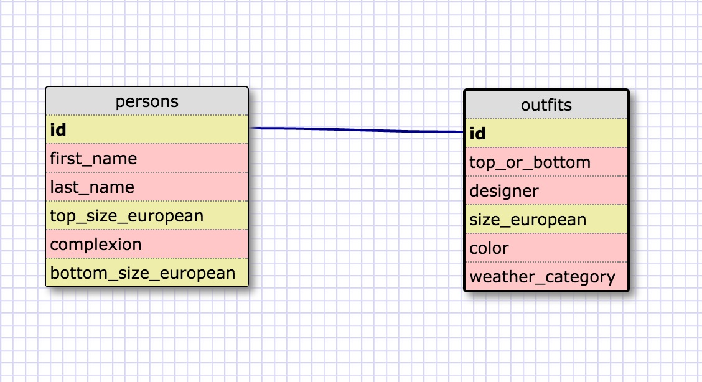

1.
SELECT *
FROM states;

2.
SELECT *
FROM regions;

3.
SELECT state_name, population
FROM states;

4.
SELECT state_name, population
FROM states
ORDER BY population DESC;

5.
SELECT state_name
FROM states
WHERE region_id=7;

6.
SELECT state_name, population_density
FROM states
WHERE population_density > 50
ORDER BY population_density;

7.
SELECT state_name
FROM states
WHERE population > 1000000 AND population < 1500000;

8.
SELECT state_name, region_id
FROM states
ORDER BY region_id;

9.
SELECT region_name
FROM regions
WHERE region_name LIKE '%Central%';

10.
SELECT region_name, state_name
FROM states
INNER JOIN regions
ON states.region_id=regions.id
ORDER BY region_id;

My Schema:

Reflection:

What are databases for?
What is a one-to-many relationship?
What is a primary key? What is a foreign key? How can you determine which is which?
How can you select information out of a SQL database? What are some general guidelines for that?

Databases store information for easy retrieval.

A one-to-many relationship is one for which you can say.  X belongs to Y.  Y has many X.  Such as a state to the United States.

A primary key is a unique value that every instance in a table has, and which can be reliably used to call only that instance.  A foreign key is a field in one table that is a unique identifier for information in another table.  The primary key is used to organize and distinguigh information in its own table.  A foreign key is used to organize information in another table.

You can select information out of a SQL database use SQL commands such as SELECT, FROM, WHERE, and ORDER BY.  By specifying clearly what kind of information you want, from where, and under what conditions, you can get the information you want.